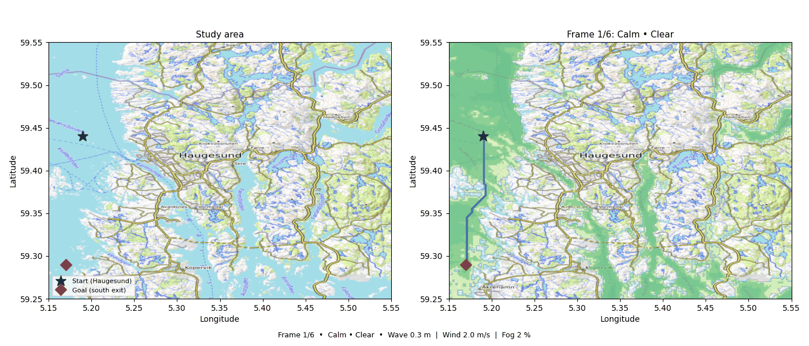

# risk-aware-a-star

[](https://github.com/jensbremnes/risk-aware-a-star/actions/workflows/tests.yml)
[](https://www.python.org/downloads/)
[](LICENSE)

Risk-optimal path planning with Bayesian network risk models. In milliseconds.

- **Millisecond replanning** — A\* completes in ~17 ms on a 400 × 400 grid; risk-map caching makes re-routes as fast as A\* alone.
- **Full Bayesian network support** — arbitrarily complex probabilistic risk models precomputed offline; runtime needs only numpy — no pgmpy on the robot.
- **Risk inflation** — a configurable spatial buffer zone expands high-risk areas by a chosen radius, producing conservative, obstacle-clearing paths with one parameter.
- **Dynamic replanning** — call `update_input()` when conditions change; the risk grid is invalidated and rebuilt automatically on the next `find_path()` call, static inputs stay cached.



`risk-aware-a-star` delivers real-time, risk-optimal path planning even when the
risk model is a full Bayesian network. It pairs with
[`geobn`](https://github.com/jensbremnes/geobn) to wire raster inputs directly into
a probabilistic risk model: `precompute()` solves all evidence-state combinations
once offline; at runtime, inference reduces to pure numpy indexing — no pgmpy on the
robot, no compromise on planning speed. Risk grid caching makes replanning as cheap
as running A\* alone.

Use it for USV and AUV mission planning · avalanche-risk ski touring ·
search-and-rescue routing · any domain where spatial risk can be modelled
probabilistically.

| BN | Nodes | Grid | State combos | Precompute | Risk map (median) | A* path (median) |
|----|-------|------|-------------|-----------|------------------|------------------|
| slope → risk | 2 | 400 × 400 | 2 | 1 ms | 1.6 ms | 16 ms |
| AUV (8-node) | 8 | 400 × 400 | 243 | 27 ms | 6 ms | 17 ms |

> Benchmarked with `tests/test_benchmark.py` on a MacBook Air 2025 (M4, 16 GB).

---

## Install

```bash
# Using uv (recommended)
uv add risk-aware-a-star

# Or with pip
pip install risk-aware-a-star
```

**Requirements:** Python ≥ 3.11, `geobn>=0.1`, `numpy`, `pyproj`, `affine`.

---

## How it works

```
OFFLINE (workstation)
───────────────────────────────────────────────────────────────────
geobn BayesianNetwork
        │
bn.precompute([risk_node])  →  bn.save_precomputed("table.npz")

RUNTIME (robot)
───────────────────────────────────────────────────────────────────
geobn BayesianNetwork  +  load_precomputed("table.npz")
                        │
                   infer()  →  extract_risk_grid()  →  2-D risk array  [0, 1]
                                                               │
                                               A* (risk-weighted cost)
                                                               │
                                                         PathResult
                                               (waypoints · cost · distance)
```

**Step cost formula**

```
step_cost = dist_px × (1 + risk_weight × risk[r, c])
```

`dist_px` is 1.0 for cardinal steps and √2 for diagonal steps (8-connectivity).
`risk[r, c]` is the marginal probability (or weighted combination of state
probabilities) at that cell, in [0, 1]. Cells where inference returns `NaN` are
impassable — A\* will never route through them.

---

## Quick start — AUV mission planning

**OFFLINE** — run once on a workstation to build the inference table:

```python
import geobn

bn = geobn.load("auv_mission.bif")
bn.precompute(["auv_risk"])
bn.save_precomputed("table.npz")
```

**RUNTIME** — load the cached table on the robot (no pgmpy calls):

```python
import geobn
from risk_aware_a_star import RiskAwareAStarPlanner

# BN must be fully configured with the same inputs and discretizations as offline.
# The .npz caches the combinatorial inference table, not the spatial rasters.
bn = geobn.load("auv_mission.bif")
bn.set_input("Slope",             geobn.RasterSource("slope.tif"))
bn.set_input("Ruggedness",        geobn.RasterSource("ruggedness.tif"))
bn.set_input("Current",           geobn.RasterSource("current.tif"))
bn.set_input("Altitude_setpoint", geobn.ConstantSource(5.0))

bn.set_discretization("Slope",             [0,     10,    15,    90],  ["Low", "Medium", "High"])
bn.set_discretization("Ruggedness",        [0,     0.005, 0.01,  1.0], ["Low", "Medium", "High"])
bn.set_discretization("Current",           [0,     0.08,  0.15,  2.0], ["Low", "Medium", "High"])
bn.set_discretization("Altitude_setpoint", [0,     5,     20,  200],   ["Close", "Moderate", "Far"])

planner = RiskAwareAStarPlanner(
    bn=bn,
    risk_node="auv_risk",
    risk_state={"Medium": 0.5, "High": 1.0},
    risk_weight=5.0,
    connectivity=8,
)
planner.load_precomputed("table.npz")

# ── Plan a mission route ──────────────────────────────────────────────────────
START = (61.300, 5.050)   # (lat, lon) WGS84 — replace with your start point
GOAL  = (61.318, 5.085)   # (lat, lon) WGS84 — replace with your goal point

result = planner.find_path(START, GOAL, return_coords="latlon")
print(f"{len(result.waypoints)} waypoints  "
      f"distance={result.total_distance_px:.0f} px  "
      f"cost={result.total_cost:.2f}")
```

The planner reprojects and resamples automatically; all inputs must overlap
spatially but need not share the same resolution or CRS.

---

## Replanning and reuse

### Multiple routes on a fixed risk map

```python
planner.load_precomputed("table.npz")

# Risk grid is computed once and cached automatically.
route_a = planner.find_path((61.300, 5.050), (61.318, 5.085))
route_b = planner.find_path((61.305, 5.060), (61.322, 5.090))
route_c = planner.find_path((61.310, 5.070), (61.320, 5.095))
# All three share the same risk grid — only A* runs for routes b and c.
```

### Dynamic replanning when sensor data changes

```python
import numpy as np

planner.load_precomputed("table.npz")

# Plan with initial current measurements.
route_1 = planner.find_path(START, GOAL)

# New current raster arrives from onboard sensor.
planner.update_input("Current", geobn.RasterSource("current_updated.tif"))

# Risk grid is recomputed automatically on the next find_path() call.
route_2 = planner.find_path(START, GOAL)
```

---

## API reference

### `RiskAwareAStarPlanner`

```python
RiskAwareAStarPlanner(bn, risk_node, risk_state, risk_weight=1.0, connectivity=8)
```

| Parameter | Type | Default | Description |
|-----------|------|---------|-------------|
| `bn` | `geobn.BayesianNetwork` | required | Configured BN with inputs and discretizations already set |
| `risk_node` | `str` | required | Name of the BN node whose marginal represents risk |
| `risk_state` | `str \| dict[str, float]` | required | State name or weighted dict, e.g. `{"Medium": 0.5, "High": 1.0}` |
| `risk_weight` | `float` | `1.0` | Trade-off factor; higher = more risk-averse, longer but safer routes |
| `connectivity` | `int` | `8` | `4` (cardinal only) or `8` (cardinal + diagonal) |

#### Methods

**`load_precomputed(path) → None`**

Restore the inference table from a `.npz` file (runtime step, replaces `precompute()`).
No pgmpy calls are made. The `bn` object must still be fully configured with the same
inputs and discretizations used offline — the `.npz` caches the combinatorial table,
not the spatial rasters.

---

**`find_path(start, goal, return_coords="latlon") → PathResult`**

Plans a risk-aware path from `start` to `goal`.

| Parameter | Type | Description |
|-----------|------|-------------|
| `start` | `(float, float)` | `(lat, lon)` in WGS84 |
| `goal` | `(float, float)` | `(lat, lon)` in WGS84 |
| `return_coords` | `str` | Output coordinate system for `PathResult.waypoints` |

`return_coords` options:

| Value | Output type | Description |
|-------|-------------|-------------|
| `"latlon"` | `(lat, lon)` float tuples | WGS84 geographic (default) |
| `"crs"` | `(x, y)` float tuples | Native CRS of the raster |
| `"pixel"` | `(row, col)` int tuples | Grid pixel indices |

Raises `RuntimeError` if `load_precomputed()` (or `bn.precompute()` before construction) has not been called, `ValueError` if `start` or `goal` is outside the grid bounds, and `RuntimeError` if no path exists between the two points.

---

### `PathResult`

Returned by `RiskAwareAStarPlanner.find_path()`.

| Attribute | Type | Description |
|-----------|------|-------------|
| `waypoints` | `list[tuple[float, float]]` | Ordered path in the requested coordinate system |
| `total_cost` | `float` | Cumulative A\* cost (distance × risk weighted) |
| `total_distance_px` | `float` | Path length in pixels (sum of Euclidean step distances) |
| `risk_grid` | `np.ndarray` | 2-D float array in [0, 1] used for planning |
| `inference_result` | `geobn.InferenceResult` | Full BN inference result (maps, GeoTIFFs, etc.) |

---

## Example

### USV route planning — Karmsundet strait, Norway

```bash
uv run --extra examples python examples/karmsundet_usv/run_example.py
```

Real EMODnet bathymetry, 150×275 grid. Ten-node BN: `water_depth`, `wave_height`,
`wind_speed`, `current_speed`, `vessel_traffic`, `fog_fraction` → `grounding_risk`,
`collision_risk`, `navigation_difficulty` → `usv_risk`. Plans a Haugesund harbour
to south-exit passage across six weather frames from calm to storm, outputting an
animated GIF and an interactive Leaflet risk map.

---

## Academic foundation

The step-cost formulation and Bayesian network integration follow the approach
described in:

> Bremnes, J., et al. (2024). *Risk-aware path planning for autonomous marine
> vehicles using Bayesian networks*. (manuscript in preparation)

---

## Declaration of AI use

This library was written with the assistance of Claude (Anthropic). All concepts,
design decisions, and research ideas originate with the author.
